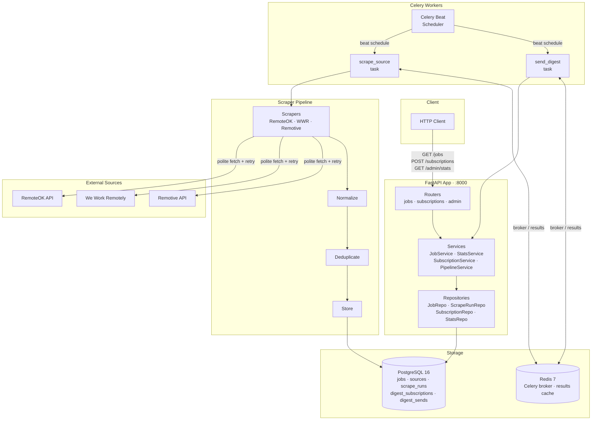

# Remote Job Scraper API

[](https://github.com/rizkimul/remote-job-scrapper-api/actions/workflows/ci.yml)


A production-grade REST API that aggregates remote developer job listings from multiple public job boards into a unified, deduplicated, queryable feed — with daily email digests and admin analytics.

Built as a freelance portfolio project demonstrating Python backend, async I/O, web scraping, ETL pipelines, and DevOps practices.

---

## Architecture



---

## Tech Stack

| Layer | Technology |
|-------|-----------|
| API | FastAPI (async) |
| ORM | SQLAlchemy 2.0 (async) + asyncpg |
| Database | PostgreSQL 16 — ARRAY tags, full-text search |
| Cache / Queue | Redis 7 |
| Task Scheduler | Celery + Celery Beat |
| Scraping | httpx + BeautifulSoup4 + selectolax |
| Config | Pydantic Settings |
| Logging | structlog (JSON in prod) |
| Migrations | Alembic (async) |
| Testing | pytest-asyncio + respx + pytest-cov |
| Lint / Types | ruff + mypy (strict) |
| CI | GitHub Actions |
| Containerisation | Docker + docker-compose |

---

## Features

- **Multi-source scraping** — RemoteOK (JSON API), We Work Remotely (HTML), Remotive (JSON API). Extensible: add a new source by subclassing `BaseScraper`.
- **ETL pipeline** — normalize → deduplicate (SHA-256 keyed) → store. Cross-source duplicates detected and dropped automatically.
- **Polite scraping** — configurable per-source delay (default 2–5s), exponential backoff with jitter, `robots.txt` compliance documented per source.
- **Full-text search** — PostgreSQL `to_tsvector` / `plainto_tsquery` across title, company, description.
- **Tag filtering** — PostgreSQL ARRAY `&&` operator for ANY-match.
- **Digest emails** — subscribers receive daily emails of new jobs, filtered by their tag/salary preferences. Idempotency table prevents resends.
- **Admin stats** — scrape success rates per source, items stored per source per day.
- **82%+ test coverage** — service, router, pipeline, and scraper layers fully tested. mypy strict passes on all 54 source files.

---

## API Endpoints

### Jobs

| Method | Path | Description |
|--------|------|-------------|
| `GET` | `/jobs` | List jobs with filters and pagination |

**Query parameters:**

| Param | Type | Description |
|-------|------|-------------|
| `tags` | `list[str]` | ANY-match tag filter (`?tags=python&tags=fastapi`) |
| `salary_min` | `int` | Jobs with `salary_min ≥ value` |
| `search` | `str` | Full-text search (title, company, description) |
| `source` | `str` | Filter by source (`remoteok`, `wwr`, `remotive`) |
| `page` | `int` | Page number (default: 1) |
| `page_size` | `int` | Items per page, max 100 (default: 20) |

### Subscriptions

| Method | Path | Description |
|--------|------|-------------|
| `POST` | `/subscriptions` | Subscribe email to daily digest |
| `DELETE` | `/subscriptions/{email}` | Unsubscribe |

### Admin

| Method | Path | Description |
|--------|------|-------------|
| `GET` | `/admin/stats/scrape-runs` | Success rate per source |
| `GET` | `/admin/stats/jobs` | Items stored per source per day (`?days=7`) |

### Infrastructure

| Method | Path | Description |
|--------|------|-------------|
| `GET` | `/health` | Health check |
| `GET` | `/docs` | Swagger UI (dev mode only) |

---

## Getting Started

### Prerequisites

- Docker + docker-compose
- (Optional) Python 3.12+ for local dev without Docker

### Run with Docker

```bash
# 1. Clone
git clone https://github.com/rizkimul/remote-job-scrapper-api.git
cd remote-job-scrapper-api

# 2. Configure
cp .env.example .env
# Edit .env — set POSTGRES_PASSWORD, APP_SECRET_KEY, and SMTP_* for digest emails

# 3. Start all services (app, postgres, redis, celery_worker, celery_beat)
docker compose up

# 4. Apply database migrations
docker compose exec app alembic upgrade head

# 5. Seed source data
docker compose exec app python -c "
from app.core.db import AsyncSessionLocal
from app.models.source import Source
import asyncio, uuid

async def seed():
    async with AsyncSessionLocal() as s:
        for name, url in [
            ('remoteok', 'https://remoteok.com'),
            ('wwr', 'https://weworkremotely.com'),
            ('remotive', 'https://remotive.com'),
        ]:
            s.add(Source(id=uuid.uuid4(), name=name, base_url=url))
        await s.commit()

asyncio.run(seed())
"

# 6. Trigger a manual scrape
docker compose exec app celery -A app.workers.celery_app call scrape_source --args='[\"remoteok\"]'

# 7. Query the API
curl "http://localhost:8000/jobs?tags=python&page_size=5" | python3 -m json.tool
```

### Example Response

```json
{
  "items": [
    {
      "id": "3f4e1a2b-...",
      "title": "Senior Python Engineer",
      "company": "Acme Corp",
      "description": "Remote Python role...",
      "tags": ["python", "fastapi", "remote"],
      "salary_min": 90000,
      "salary_max": 130000,
      "currency": "USD",
      "posted_at": "2026-05-18T00:00:00Z",
      "source_url": "https://remoteok.com/remote-jobs/123",
      "source_name": "remoteok",
      "created_at": "2026-05-18T06:00:00Z"
    }
  ],
  "total": 142,
  "page": 1,
  "page_size": 5,
  "pages": 29
}
```

---

## Running Tests

```bash
# All tests with coverage report
docker compose exec app pytest --cov=app --cov-report=term-missing

# Single file
docker compose exec app pytest tests/services/test_stats_service.py -v

# Coverage gate (fails if < 70%)
docker compose exec app pytest --cov=app --cov-fail-under=70
```

Current coverage: **83%** across 115 tests.

---

## Project Structure

```
app/
├── core/           # Config, DB, Redis, logging, exceptions
├── models/         # SQLAlchemy ORM models (Source, ScrapeRun, Job, ...)
├── schemas/        # Pydantic DTOs (API contracts)
├── repositories/   # All SQL queries (never in services or routers)
├── services/       # Business logic and orchestration
├── routers/        # HTTP layer — validation and delegation only
├── scrapers/       # One module per source site (BaseScraper + concrete scrapers)
│   ├── base.py     # Abstract base: fetch → retry → parse → log
│   ├── remoteok/
│   ├── wwr/
│   └── remotive/
├── pipelines/      # ETL stages: normalize → deduplicate → store
└── workers/        # Celery tasks: scrape_source, send_digest, cleanup_stale

tests/              # Mirrors app/ structure
docs/               # Step-by-step build journal (learning notes)
.github/workflows/  # CI pipeline
docker/             # Dockerfile
alembic/            # Database migrations
```

**Strict layering rules:**
- Routers → Services → Repositories → DB (no layer skipping)
- Scrapers return raw data — they never write to DB
- All I/O is async — no sync DB calls anywhere

---

## Architectural Patterns

| Pattern | Where Used |
|---------|-----------|
| Strategy | `BaseScraper` subclasses — swap source without changing pipeline |
| Repository | All DB access isolated in `repositories/` |
| CQRS-lite | Read services (stats, jobs) separate from write services (pipeline) |
| Template Method | `BaseScraper.scrape()` — fixed flow, overridable steps |
| Bloom Filter (key store) | SHA-256 `DedupKey` table for cross-source dedup |
| Dependency Injection | FastAPI `Depends()` — testable without real DB |

---

## Scraping Policy

All sources are scraped in compliance with their `robots.txt` and public API terms. See `app/scrapers/<source>/README.md` for per-source policy documentation.

- Configurable polite delay (default 2–5s between requests)
- Exponential backoff with jitter on retry (3 attempts max)
- Identifiable `User-Agent` header
- Public job listings only — no login-wall scraping

---

## Build Log

| # | Feature | Status |
|---|---------|--------|
| 1 | Project scaffold + Docker Compose | ✅ |
| 2 | DB models + Alembic async migrations | ✅ |
| 3 | BaseScraper + RemoteOK scraper | ✅ |
| 4 | ETL pipeline: normalize → dedup → store | ✅ |
| 5 | Celery scrape_source task + beat schedule | ✅ |
| 6 | `GET /jobs` with filters, pagination, full-text search | ✅ |
| 7 | WWR + Remotive scrapers (proves abstraction) | ✅ |
| 8 | Digest subscriptions + `send_digest` Celery task | ✅ |
| 9 | Admin stats endpoints | ✅ |
| 10 | 115 tests, 83% coverage, mypy strict | ✅ |
| 11 | GitHub Actions CI pipeline | ✅ |
| 12 | Portfolio README + Mermaid architecture diagram | ✅ |

---

## License

MIT
